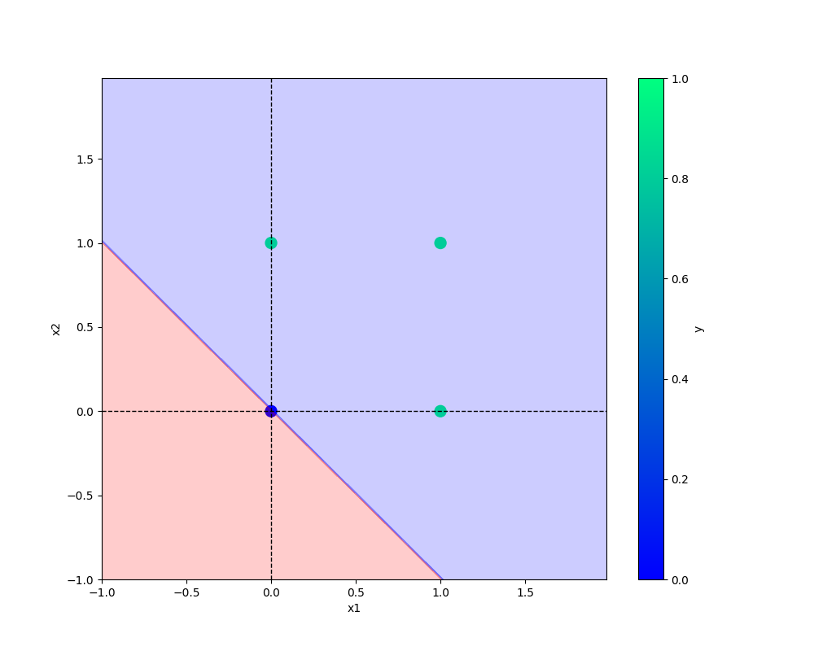

# Neuron
Building perceptron from scratch, building models for AND, OR gates. All code is organized and setup all logging.

## Python package
This code has been converted to python PyPI package. Refer
[Neuron PyPI](https://pypi.org/project/Neuron-pypi-SivaNagendra-sn/)

Anyone can download and train a perceptron model with own datasets.

## Result Images
### AND GATE

### OR GATE
